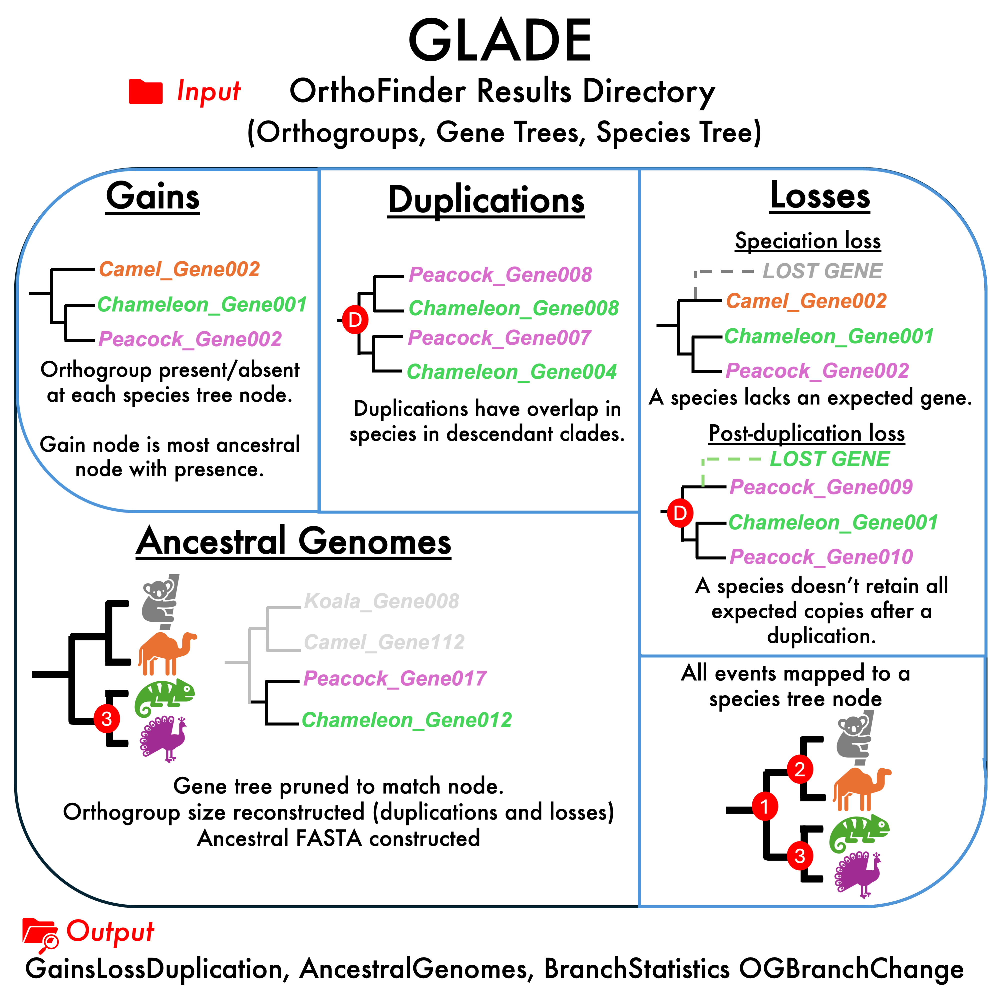

# GLADE

Gains, Losses, AncestralGenomes, Duplications, Evolution!

GLADE is a Python tool for reconstructing the full evolutionary history of orthogroups — including gene gains, losses, duplications, and ancestral gene repertoires — using only an OrthoFinder v3 results directory as input. GLADE maps every event onto the species tree and produces rich output for comparative genomics.

<p align="center">
  
</p>

GLADE is a work in progress - proceed with caution!!!

## Table of contents
- [What is GLADE?](#What-is-GLADE)
- [Installation](#Installation)
- [How-to-use](#Simple-usage)
- [Output files](#Output-files)
- [Example-data](#Example-data)
- [Citation](#Citation)

## What is GLADE?

GLADE reconstructs the history of orthogroups — defined as sets of genes descended from a single gene in the most recent common ancestor — across a species tree.

Given a complete OrthoFinder v3 run, GLADE:
- Identifies where each orthogroup first appeared (gain)
- Detects losses
- Identifies gene duplication events
- Reconstructs ancestral gene content at every internal node,
- Quantifies orthogroup size changes along every branch,
- Outputs complete evolutionary histories for all orthogroups.

<p align="center">

</p>

## Installation

GLADE requires Python 3.9 or later

GLADE requires the same dependencies as OrthoFinder. We reccommend that you run GLADE in an orthofinder conda environment.

See the OrthoFinder github for details on how to set this up https://github.com/OrthoFinder/OrthoFinder?tab=readme-ov-file#installation

## Simple usage

```python GLADE.py -f path/to/orthofinder/results```

## Output files

GLADE produces a structured directory containing:

1. Gains, Losses, and Duplications (GainsLossDuplication/)
- Gains.tsv — where each orthogroup first appeared
- Loss_speciation.tsv — orthogroup losses due to speciation
- Loss_postduplication.tsv — losses after duplication events
- Duplications.tsv — duplication events with support values
- Branch_statistics.tsv — event counts per species-tree branch
- *_bybranch.tsv — expanded lists of orthogroups per event type
- extant_OG_counts.tsv — gene counts in extant species
- OrthogroupBranchChange.tsv — size changes per branch

2. AncestralGenomes/

One FASTA file per internal node containing reconstructed ancestral sequences
- AncestralGenomes.txt — summary statistics
- Ancestral_HOG_counts.csv — orthogroup copy numbers for all nodes

## Example data

Unzip the ExampleData.zip file, which contains an OrthoFinder results directory on a small dataset.
Then run:

```
python GLADE.py -f ExampleData/OrthoFinder/Results_ExampleDataGLADE/
```

## Citation

coming soon to biorxiv
Belcher L.J. et al. (2025) GLADE

