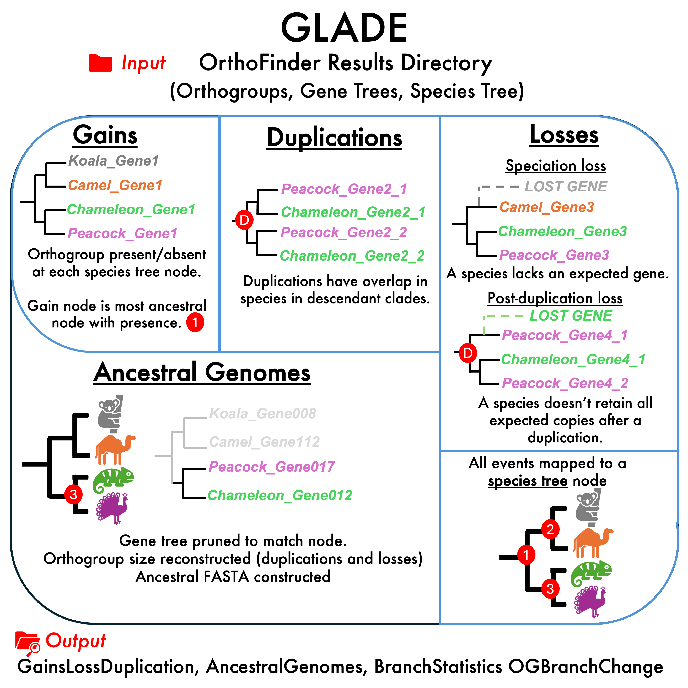

# GLADE

GLADE: Accurate inference of Gains, Losses, Ancestral genomes, and Duplication Events for comparative genomics

Current version: **v1.0.0** (see [CHANGELOG.md](CHANGELOG.md)). Check your version with `python GLADE.py --version`.

GLADE is a Python tool for reconstructing the full evolutionary history of orthogroups — including gene gains, losses, duplications, and ancestral gene sets — using only an OrthoFinder v3 results directory as input. GLADE maps every event onto the species tree and produces rich output for comparative genomics.

<p align="center">
  
</p>


## Table of contents
- [What is GLADE?](#What-is-GLADE)
- [Installation](#Installation)
- [How-to-use](#Simple-usage)
- [Input requirements](#Input-requirements)
- [Output files](#Output-files)
- [Reproducibility](#Reproducibility)
- [Example-data](#Example-data)
- [Testing](#Testing)
- [Citation](#Citation)

## What is GLADE?

GLADE reconstructs the history of orthogroups — defined as sets of genes descended from a single gene in the most recent common ancestor — across a species tree.

Given a complete OrthoFinder v3 run, GLADE:
- Identifies where each orthogroup first appeared (gain)
- Detects losses
- Identifies gene duplication events
- Reconstructs ancestral gene content at every internal node,
- Quantifies orthogroup size changes along every branch,
- Outputs complete evolutionary histories for all orthogroups.

<p align="center">

</p>

## Installation

GLADE requires Python 3.9 or later.

GLADE requires the same dependencies as OrthoFinder v3 (ete4 and numpy). We recommend that you run GLADE in an OrthoFinder conda environment, so there is nothing extra to install.

See the OrthoFinder github for details on how to set this up https://github.com/OrthoFinder/OrthoFinder?tab=readme-ov-file#installation

If you are not using an OrthoFinder environment:

```
pip install -r requirements.txt
```

Then download GLADE (or `git clone https://github.com/lauriebelch/GLADE.git`) and run `scripts/GLADE.py`.

GLADE runs fine on a laptop or desktop. Very large datasets (hundreds of species) are quicker on a server with more threads.

## Simple usage

```python GLADE.py -f path/to/orthofinder/results -t threads [default=8]```

Options:
- `-f` / `--folder` — the OrthoFinder results folder (e.g. `OrthoFinder/Results_Jan01`)
- `-t` / `--threads` — number of threads (default 8)
- `-s` / `--seed` — random seed for choosing genes in the ancestral gene sets (default 1). The same input and seed always gives the same output
- `-v` / `--version` — print the GLADE version


If you are running GLADE on an OrthoFinder assign run - you need to add the proteomes from the core run to the assign results directory

e.g. cd to core/WorkingDirectory and cp *.fa to the assign/WorkingDirectory


## Input requirements

- A complete OrthoFinder v3 results folder (GLADE reads `Orthogroups/`, `Resolved_Gene_Trees/`, `Species_Tree/SpeciesTree_rooted_node_labels.txt`, `WorkingDirectory/SpeciesIDs.txt`, `WorkingDirectory/SequenceIDs.txt` and the `WorkingDirectory/Species*.fa` files)
- A **rooted, fully bifurcating species tree** (as OrthoFinder requires). If you gave OrthoFinder your own species tree with a polytomy, GLADE will stop and tell you which node needs resolving
- Species and gene names can contain characters such as `.` `(` `)` `+` `|`. OrthoFinder changes some of these (e.g. `(` and `)` become `_` in the gene trees) and GLADE matches the names either way. If a name still can't be matched, GLADE stops and says which one
- Orthogroups with fewer than 4 genes are skipped, because OrthoFinder does not build gene trees for them

## Output files

GLADE writes its results into the OrthoFinder results folder, in two new folders: `GainsLossDuplication/` and `AncestralGenomes/`, plus a `GLADE_run_info.txt` file. All files use species names and the original gene names.

(`WorkingDirectory/GladeWD/` holds intermediate files with OrthoFinder's numeric species and gene codes. You don't need these.)

Branches are named `parent___child`, e.g. `N1___Mycoplasma_hyopneumoniae` is the branch from node N1 to that species.

### 1. GainsLossDuplication/

| File | One row per | Columns |
|---|---|---|
| Gains.tsv | orthogroup | `Gain Node` (node where the orthogroup first appears), `Parent Node`, `Orthogroup` |
| Loss_speciation.tsv | loss of an orthogroup from a clade | `Orthogroup`, `Node` (species-tree node), `Species` (species in the clade that lost it), `Child Node` (the clade that lost it) |
| Duplications.tsv | gene duplication | `genetree_node`, `leaves1` and `leaves2` (the genes on each side of the duplication; at a gene-tree polytomy `leaves2` holds all the other child clades), `speciestree_node` (where the duplication maps on the species tree), `support` (fraction of expected species with both copies; events with support ≥ 0.5 are counted, as in OrthoFinder), `Orthogroup` |
| Loss_postduplication.tsv | loss of one copy after a duplication (duplications with support ≥ 0.5 at bifurcating gene-tree nodes; at a polytomy the order of events can't be told) | `Orthogroup`, `Focal Node` (gene-tree duplication node), `Lost Species`, `Child Node` (gene-tree clade missing the species), `Species Node` |
| Branch_statistics.tsv | species-tree branch | `branch`, `branch_length`, `N_gains`, `N_speciation_losses`, `N_duplications`, `N_postduplication_losses` |
| Gains_bybranch.tsv, Loss_speciation_bybranch.tsv, Duplications_bybranch.tsv, Loss_postduplication_bybranch.tsv | event | `Branch`, orthogroup ID |
| extant_OG_counts.tsv | orthogroup | `Desc`, `Family_ID`, then the number of genes in each extant species |
| OrthogroupBranchChange.tsv | orthogroup × branch | `Orthogroup_Branch`, `Orthogroup`, `Branch`, `Parent_Node`, `Focal_Node`, `family_size` (genes at the child node), `parent_size` (genes at the parent node), `Branch_length`, `change` (family_size − parent_size), `change_per_time` (|change| / branch length) |

### 2. AncestralGenomes/

These are ancestral gene sets: for each internal node of the species tree, the genes of every orthogroup present at that node. Each gene is represented by a real sequence from a descendant species (the median root-to-tip distance gene), not a reconstructed ancestral sequence. They are useful as, for example, a BLAST database of ancestral gene content.

| File | Contents |
|---|---|
| N0.fasta, N1.fasta, ... | one FASTA per internal node. Headers are `>{node}_{orthogroup}_{copy}_{copies}_{species}_{gene}`, e.g. `>N1_OG0000003_1_1_Mycoplasma_agalactiae_gi\|290752424\|...` |
| AncestralGenomes.txt | `Node`, `Gene_Count`, `Number_of_amino_acids` |
| Ancestral_HOG_counts.csv | orthogroup copy number at each internal node (one column per node) |

## Reproducibility

- Each run writes `GLADE_run_info.txt` with the GLADE version, the command, the seed and the number of threads
- Choosing which genes represent a duplicated orthogroup in the ancestral gene sets involves a random choice. This is seeded with `--seed`, so the same input and seed give identical output (whatever the number of threads)
- Tagged releases are on GitHub, and each is archived on Zenodo with a DOI

## Example data

Unzip the ExampleData.zip file, which contains an OrthoFinder results directory on a small dataset.
Then run:

```
python GLADE.py -f ExampleData/OrthoFinder/Results_ExampleDataGLADE/
```

## Testing

The `tests/` folder has tests that run GLADE on the example data, including edited copies that check awkward inputs (dots in species names, `(` `)` `+` in gene names, species names starting with "n", species-tree polytomies, gene-tree polytomies compared to OrthoFinder's own duplications, and the same output from the same seed). To run them:

```
pip install pytest
pytest -v tests/
```

## Citation

Belcher L.J. & Kelly S. (2026) GLADE: Accurate inference of Gains, Losses, Ancestral genomes, and Duplication Events for comparative genomics. [bioRxiv](https://www.biorxiv.org/content/10.64898/2026.01.27.702036v1)

